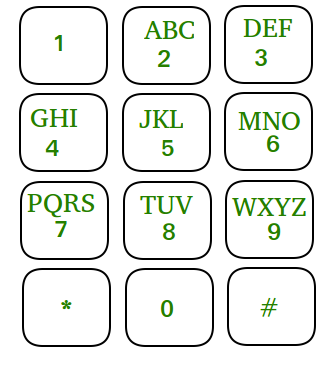

## T9 numbers to words

I am unsure of the official problem but you can find the full version of it
at this [site](https://www.geeksforgeeks.org/find-possible-words-phone-digits/).

### Question

Before advent of QWERTY keyboards, texts and numbers were placed on the same key. For 
example 2 has “ABC” if we wanted to write anything starting with ‘A’ we need to type key
2 once. If we wanted to type ‘B’, press key 2 twice and thrice for typing ‘C’. below is
picture of such keypad.



Given a keypad as shown in diagram, and a n digit number, list all words which are possible
by pressing these numbers. For example if input number is 234, possible words which can 
be formed are (Alphabetical order): adg adh adi aeg aeh aei afg afh afi bdg bdh bdi beg beh bei bfg 
bfh bfi cdg cdh cdi ceg ceh cei cfg cfh cfi

### Solution

You may be able to solve this problem in a few different ways but recursion is the only one
that I can think of after solving it that way the first time. The problem also easily lends
itself to being broken down into sub problems since to get all possible letter combinations
you need to go through everything.

The cases break down like this.

 - If we have made it all the way through the number return the word
 - If the current number to check if 0 or 1 exit or start a new word after. (up to you)
 - If the number if 2-9 append the character to the word and call function again

For instance if we have "a" and the next number is 3 we now need "ad", "ae", "af".
We then need to call solver for each of these until we reach the end. Golang doesn't
have sets so to keep the output clean I wrote a simple appender function.

```golang
package main

import (
        "fmt"
)

// T9 mapping of number to chars
var t9 = map[int]string{
        1: "",
        2: "abc",
        3: "def",
        4: "ghi",
        5: "jkl",
        6: "mno",
        7: "pqrs",
        8: "tuv",
        9: "wxyz",
        0: "",
}

var rets = []string{}

func appender(word string) {
        for _, v := range rets {
                if v == word {
                        return
                }
        }

        rets = append(rets, word)
}

func solver(number []int, word string, num int) {
        if len(number) == num {
                appender(word)
                return
        }

        if number[num] == 0 || number[num] == 1 {
                solver(number, "", num+1)
                appender(word)
        }

        for _, v := range t9[number[num]] {
                solver(number, word+string(v), num+1)
        }
}

func main() {
        number := []int{8, 2, 4, 2, 2, 0, 5, 5, 5, 5}
        solver(number, "", 0)
        fmt.Println(rets)
}
```

### Why this is a bad question

I can't think of many reasons this is bad however it does force you to solve it one way
and doesn't have a lot of wiggle room for creative solutions.

### Why this is a good question

Depending on how fast someone is able to solve it you can change this around a lot to
make it much more difficult. For instance you can make it so that if you hit 0 or 1
you need to start a new word keeping track of the old still. Additionally you can have
someone show how they would optimize this to terminate early on words that aren't in the
dictionary.
